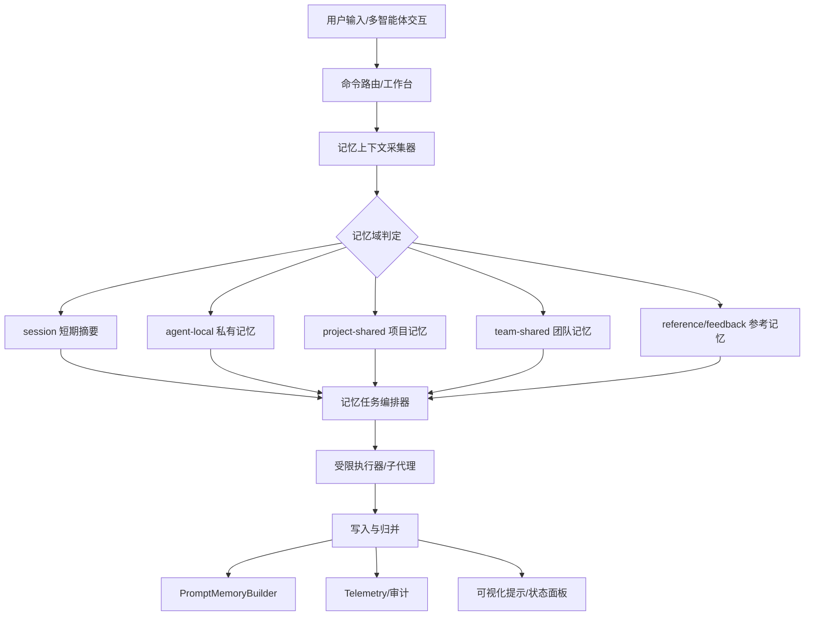

# Claude Code 记忆系统与多智能体优化设计文档

> 基于 `E:/AGENT-ROOT/04-PROJECTS/claude-code/restored-src/src` 的恢复源码，对 Claude Code 的终端显示相关实现、会话记忆、长期记忆、团队记忆、自动提取/归并机制以及多智能体下的记忆协作方式进行细粒度拆解；并与 `zyfront-desktop` 当前实现对比，给出一套可落地的优化设计方案与详细里程碑。

---

## 1. 背景与目标

### 1.1 背景

当前 `zyfront-desktop` 已经具备较完整的记忆与多智能体骨架：

- `src/app/core/memory/prompt-memory-builder.service.ts` 负责多层记忆拼装与预算控制。
- `src/app/core/multi-agent/multi-agent-sidebar.component.ts` 负责多智能体工作区的可视化入口。
- `src/app/features/prototype/workbench/*` 负责命令路由、指令执行、输入预处理、工作台交互。
- `src/app/features/prototype/collaboration/*` 负责协作状态、动画、快照与实验性协同体验。

但与 Claude Code 恢复源码相比，当前实现仍存在以下差距：

1. 记忆层结构更偏“前端拼接”，缺少统一的后台自动提取与归并闭环。
2. 多智能体之间的记忆边界、共享边界、同步边界不够清晰。
3. 终端显示、思考流、记忆更新之间缺少统一的状态模型。
4. 记忆写入策略更像“输入聚合”，而非“按规则演化的记忆系统”。

### 1.2 目标

本文目标不是简单复刻 Claude Code，而是把其记忆系统中真正有价值的机制抽象出来，落到 `zyfront-desktop` 的架构里，重点解决：

- 长短期记忆如何分层管理
- 多智能体之间如何隔离与共享记忆
- 记忆如何自动提取、自动更新、自动归并
- 终端显示如何与记忆状态形成闭环
- 如何以里程碑方式分阶段实现，降低风险

---

## 2. Claude Code 恢复源码中的记忆系统结论

> 本节综合恢复源码中与记忆相关的实现：
> - `services/SessionMemory/sessionMemory.ts`
> - `tools/AgentTool/agentMemory.ts`
> - `utils/teamMemoryOps.ts`
> - `components/MemoryUsageIndicator.tsx`
> - 以及文档 `MEMORY_SYSTEM_ARCHITECTURE_ZH.md` 中的系统分层描述

### 2.1 记忆不是单文件，而是多层系统

Claude Code 的记忆系统至少分为五层：

1. **路径与开关层**
   - 负责控制是否启用记忆、写到哪里、允许哪些目录。
2. **提示注入层**
   - 在系统提示中告诉主 Agent 应该如何理解和更新记忆。
3. **自动提取层**
   - 在对话轮次结束后，异步启动子代理提取新的可记忆信息。
4. **自动归并层**
   - 将历史记忆做周期性的 consolidation，减少碎片化。
5. **团队同步层**
   - 将 team memory 通过 watcher / 同步服务在本地与远端之间保持一致。

此外还有一条并行的 **Session Memory**：

- 用于当前会话的短期摘要，不等同于长期主题记忆。
- 也是通过 forked agent 更新，但写入目标非常单一。

### 2.2 Session Memory 的关键实现细节

`services/SessionMemory/sessionMemory.ts` 是最具代表性的“自动记忆”实现之一。它体现了四个重要设计点：

#### 2.2.1 触发阈值不是单一维度，而是“双阈值+自然断点”

它的触发条件不是简单地“消息多了就写”，而是：

- 首次初始化需要达到消息 token 门槛
- 后续更新需要达到 token 增长门槛
- 还要结合工具调用次数门槛
- 如果最近一轮没有工具调用，则在自然对话断点也可触发

这比“每 N 轮保存一次”更智能，因为它更接近真实语义边界。

#### 2.2.2 只允许写一个具体文件

`createMemoryFileCanUseTool(memoryPath)` 只允许 `FileEditTool` 修改唯一的 memory 文件。也就是说：

- 子代理不能乱写别的文件
- 不能创建额外记忆分支
- 记忆更新是强约束、单目标的

这使得系统极易审计，也很适合做会话摘要。

#### 2.2.3 使用 forked agent 执行更新

更新过程不是主线程直接做，而是：

- 创建隔离上下文
- 准备当前 memory 文件内容
- 生成更新提示
- 通过 `runForkedAgent` 执行

这带来两个好处：

1. 主对话流不会被打断。
2. 记忆更新可以用独立上下文做读取/编辑，不污染主会话状态。

#### 2.2.4 记忆状态是可观测的

它会记录：

- token 使用情况
- 配置阈值
- 是否触发
- 是否初始化完成

这意味着记忆不是黑盒，而是可追踪的后台流水线。

### 2.3 Persistent Agent Memory 的关键实现细节

`tools/AgentTool/agentMemory.ts` 代表了“每个智能体拥有自己的持久记忆”的设计思想。

#### 2.3.1 记忆按 scope 分层

它支持三种范围：

- `user`
- `project`
- `local`

其中：

- `user` 适合跨项目通用经验
- `project` 适合团队共享、版本控制中的项目经验
- `local` 适合机器与项目组合上下文下的私有经验

#### 2.3.2 记忆目录计算严格区分 scope

它不是一个统一目录，而是按 scope 计算路径：

- 用户级：基于 memory base
- 项目级：基于当前 cwd 的 `.claude/agent-memory`
- 本地级：在 remote memory 场景下映射到共享挂载，否则落在本地 cwd

#### 2.3.3 路径白名单由 `isAgentMemoryPath` 明确限定

这很关键，因为多智能体系统最怕“记忆写入越权”。

Claude Code 的做法是：

- 先判断 normalized path
- 再根据 scope 与根路径做白名单判断
- 只有落在允许目录内才算合法记忆路径

#### 2.3.4 记忆提示是主动注入的

`loadAgentMemoryPrompt()` 会把该 agent 的记忆目录内容嵌入 prompt，并附加 scope 说明。也就是说：

- 记忆不是外部旁路系统
- 它是 Agent 上下文的一部分
- 不同 scope 的行为约束直接写入提示语义

### 2.4 Team Memory 的关键实现细节

`utils/teamMemoryOps.ts` 体现了团队记忆的识别与操作方式。

它主要做三件事：

1. 识别 search 是否命中 team memory
2. 识别 write/edit 是否命中 team memory
3. 将 team memory 的读写统计转换成可解释文本

这说明团队记忆在 Claude Code 中不是额外的“多人协作附件”，而是一个被系统理解、统计、提示和同步的正式对象。

### 2.5 Memory Usage Indicator 的意义

`components/MemoryUsageIndicator.tsx` 本身不是记忆系统核心，但它体现了一个重要理念：

- 记忆系统和运行时资源状态应当可视化
- 内存压力是需要在终端侧暴露的运行信号

这类指示器意味着：记忆系统不仅要写得对，还要能让用户感知系统健康度。

---

## 3. Claude Code 的多智能体记忆设计思想

### 3.1 不是“每个智能体各写各的”，而是“有层级的记忆域”

Claude Code 的核心思路并不是简单给每个 Agent 一个本地笔记本，而是建立层级：

- **主会话记忆**：服务当前对话上下文
- **智能体记忆**：服务某一 agent 类型的持续学习
- **团队记忆**：服务协作中共享知识
- **会话摘要**：服务当前上下文压缩

这使得多智能体不会把同一份知识反复写成碎片。

### 3.2 记忆写入必须与智能体身份绑定

在多智能体场景中，最关键的不是“谁看见了什么”，而是：

- 哪个 agent 产生了这条知识
- 这条知识属于哪个 scope
- 是否可共享到团队
- 是否只属于本次会话

Claude Code 通过不同目录、不同门禁和不同提示层完成这些边界控制。

### 3.3 记忆更新应当是低耦合后台任务

所有自动提取、归并、摘要，本质上都是：

- 独立后台任务
- 与主线程解耦
- 受权限沙箱限制
- 可并发抑制、可节流、可合并

这非常适合多智能体系统，因为主线程一旦被记忆操作阻塞，整个体验会迅速变差。

---

## 4. `zyfront-desktop` 当前实现的记忆系统分析

### 4.1 已有基础能力

`zyfront-desktop` 当前记忆构建的主体是：

```16:216:zyfront-desktop/src/app/core/memory/prompt-memory-builder.service.ts
export class PromptMemoryBuilderService {
  ...
}
```

它已经实现了较完整的“前端拼装式记忆层”能力：

- 多层加载
- 并行 I/O
- 字符预算
- 去重
- 会话短期摘要
- 历史对话回放
- 构建报告与埋点

这说明 `zyfront-desktop` 的记忆系统已经不是简单字符串拼接，而是具备一定工程化水平。

### 4.2 当前实现的特点

#### 4.2.1 强前端聚合

当前模型倾向于在 prompt 生成时聚合：

- user memory
- feedback memory
- project memory
- reference memory
- session short-term memory
- conversation history
- user query

这使得 prompt 构建逻辑很强，但记忆本身的生命周期管理偏弱。

#### 4.2.2 更像“输入框架”，不是“记忆系统”

目前 `PromptMemoryBuilderService` 更接近：

- 从不同来源取记忆
- 做预算与压缩
- 再拼出最终 prompt

而不是：

- 主动学习
- 自动提取
- 自动写回
- 自动归并
- 多智能体协商记忆边界

#### 4.2.3 记忆来源分散

从项目结构看，记忆相关逻辑分布在：

- `core/memory`
- `core/multi-agent`
- `features/prototype/workbench`
- `features/prototype/collaboration`

这说明已经有领域划分，但缺少统一的记忆协调器。

### 4.3 与 Claude Code 的核心差距

#### 差距 1：缺少后台自动提取闭环

Claude Code 会在轮次结束后自动触发提取/归并；
`zyfront-desktop` 当前更多是前端读取现成内容，没有形成自动写回闭环。

#### 差距 2：缺少记忆写入沙箱

Claude Code 对可写目录和工具能力限制很严；
`zyfront-desktop` 当前更像在 vault 中读取/拼装，缺少统一的“谁能改哪里”的记忆沙箱层。

#### 差距 3：多智能体记忆边界不够明确

当前多智能体更多体现为 UI 侧协同与工作区交互，记忆层尚未明确区分：

- agent 私有记忆
- 项目共享记忆
- 团队共享记忆
- 会话摘要记忆

#### 差距 4：缺少记忆健康状态可观测性

Claude Code 有记忆使用提示、后台日志与事件埋点；
`zyfront-desktop` 还可以进一步把记忆构建、压缩、截断、去重、写入失败等状态显式呈现。

---

## 5. 对比分析：Claude Code vs `zyfront-desktop`

### 5.1 体系差异

| 维度 | Claude Code 恢复源码 | `zyfront-desktop` 当前实现 |
|---|---|---|
| 记忆定位 | 多层级系统：session / agent / team / summary | 以 prompt 聚合为主 |
| 自动提取 | 后台 forked agent 自动触发 | 主要是前端构建与读取 |
| 写入边界 | 严格的路径与工具沙箱 | 边界较弱，偏前端汇总 |
| 多智能体 | agent memory scope 明确 | 多智能体能力较强，但记忆边界未完全统一 |
| 可观测性 | gate、threshold、event、log | 已有 report/telemetry，但缺少自动写回链路 |
| 体验目标 | 稳定、可解释、低噪音 | 功能强、信息密度高，但需要进一步结构化 |

### 5.2 架构哲学差异

Claude Code 的哲学是：

- 记忆是一个后台演化系统
- prompt 是记忆系统的读出层
- 多智能体记忆必须分域
- 主线程不能被记忆任务阻塞

`zyfront-desktop` 的哲学更像：

- 先把可用信息拼到 prompt 里
- 再围绕 prompt/工作台做交互
- 多智能体更偏协作界面，而不是记忆治理系统

### 5.3 风险差异

如果继续沿用当前方式，`zyfront-desktop` 未来会面临：

1. prompt 拼装越来越复杂
2. 多智能体记忆来源越来越多，边界越来越模糊
3. 记忆数据量上升后，预算、去重、质量问题更突出
4. 用户会看到“信息很多”，但系统未必真的“学会了”

---

## 6. 优化目标：把 `zyfront-desktop` 的记忆系统升级为“多智能体记忆操作系统”

建议将目标定义为三层：

### 6.1 第一层：统一记忆域模型

把所有记忆统一归类为：

- `session`：当前会话摘要
- `agent-local`：单智能体私有记忆
- `project-shared`：项目共享记忆
- `team-shared`：团队共享记忆
- `reference`：参考知识与模板记忆
- `feedback`：反馈型修正记忆

### 6.2 第二层：统一记忆生命周期

每一类记忆都应支持：

- 生成
- 提取
- 去重
- 更新
- 归并
- 冻结
- 过期
- 回收

### 6.3 第三层：统一记忆执行模型

所有记忆操作都应走统一的后台流程：

- 识别触发条件
- 构建记忆任务
- 运行受限执行器
- 写入目标存储
- 回传结果与状态
- 记录 telemetry 与审计信息

---

## 7. 推荐的目标架构

### 7.1 架构总图



### 7.2 核心模块职责

#### 7.2.1 `MemoryScopeResolver`

负责决定一条知识属于哪个域：

- 当前会话
- 某个 agent
- 项目共享
- 团队共享
- 参考/反馈

#### 7.2.2 `MemoryTaskScheduler`

负责触发时机控制：

- token 阈值
- tool-call 阈值
- 自然断点
- 手动 summary
- 项目切换
- 多智能体会话结束

#### 7.2.3 `MemorySandboxExecutor`

负责安全执行：

- 限制可写目录
- 限制可用工具
- 阻止越权写入
- 防止多个 agent 交叉污染

#### 7.2.4 `MemoryConsolidationService`

负责把碎片记忆整理成稳定结构：

- 去重
- 合并
- 提炼规则
- 降噪
- 版本化

#### 7.2.5 `MemoryTelemetryService`

负责记录：

- 触发次数
- 写入文件数
- 压缩比
- 截断数
- 去重数
- 写入失败原因

---

## 8. 多智能体记忆设计细则

### 8.1 记忆隔离原则

每个智能体默认拥有自己的 `agent-local` 记忆域，避免：

- A 智能体把调试信息写进 B 智能体提示词
- 某个工具型智能体污染项目共享记忆
- 临时试验内容进入长期记忆

### 8.2 记忆共享原则

只有满足以下条件的内容才能进入共享域：

1. 可复用
2. 非私密
3. 非瞬时
4. 能被其他智能体稳定理解
5. 能通过归并规则去重

### 8.3 记忆权限原则

建议采用和 Claude Code 类似的权限约束：

- 读权限宽于写权限
- 写权限按域授权
- 归并权限独立于写权限
- 团队记忆写入需要更严格的确认和审计

### 8.4 智能体身份与记忆映射

每个智能体应有：

- `agentId`
- `agentType`
- `scope`
- `memoryPath`
- `policyVersion`
- `lastUpdatedAt`

这样才能在多智能体编排中建立稳定映射关系。

---

## 9. 与现有 `zyfront-desktop` 模块的集成建议

### 9.1 与 `PromptMemoryBuilderService` 的关系

建议把它从“记忆拼装器”升级为“记忆读出器 + 报告生成器”。

它继续负责：

- 读取多层记忆
- 做预算控制
- 生成 prompt
- 输出构建报告

但新增职责不要塞进去，应该交给独立服务：

- `MemoryScopeResolver`
- `MemoryTaskScheduler`
- `MemoryConsolidationService`

### 9.2 与 `multi-agent-sidebar.component.ts` 的关系

侧边栏可以扩展出：

- 当前 agent 的记忆状态
- 共享记忆状态
- 最近写入/最近归并
- 记忆冲突告警
- 记忆健康度

这能让多智能体从“可见”升级到“可理解”。

### 9.3 与 `workbench` 命令系统的关系

建议把记忆任务也纳入 command system：

- `/memory summarize`
- `/memory agent <id>`
- `/memory team sync`
- `/memory project consolidate`

这样记忆系统可被显式操作，而不是只靠后台自动化。

### 9.4 与 `collaboration` 的关系

协作模式下应支持：

- 共享记忆广播
- 快照级记忆恢复
- 冲突解决提示
- 多人会话下的记忆写入提议

---

## 10. 详细功能设计

### 10.1 记忆域文件结构建议

建议目录概念如下：

- `agent-long-user/`
- `agent-long-project/`
- `agent-long-reference/`
- `agent-long-feedback/`
- `agent-short-term/`
- `team-shared/`
- `project-shared/`

每个目录下建议采用：

- 一个 `MEMORY.md` 作为索引
- 多个主题记忆文件
- 必要时带元数据 JSON

### 10.2 记忆条目格式建议

建议统一记忆条目字段：

- `id`
- `scope`
- `source`
- `agentId`
- `sessionId`
- `createdAt`
- `updatedAt`
- `confidence`
- `importance`
- `ttl`
- `content`
- `tags`
- `relations`

### 10.3 触发规则建议

参考 Claude Code 的“双阈值+断点”策略，建议：

- 初始化阈值：保证早期不会过度写入
- 更新阈值：按 token 增长与工具调用双条件触发
- 断点触发：在自然对话停顿、命令执行结束、智能体切换时触发
- 手动触发：用户显式要求总结/归档时触发

### 10.4 去重与归并建议

建议采用三层去重：

1. **文本级去重**：哈希去重相似段落
2. **语义级去重**：同义合并
3. **策略级去重**：按域策略保留更高质量条目

归并建议保留：

- 最新版本
- 最高置信度版本
- 最常被引用版本

### 10.5 过期与回收建议

对于短期记忆：

- 过期后自动压缩进 session summary
- 再进入长期记忆前需复核

对于团队记忆：

- 需要显式删除与版本回滚能力
- 不能仅靠 TTL 清理

---

## 11. 推荐的数据流

### 11.1 在线路径

1. 用户发起输入
2. 工作台路由命中某一智能体或执行模式
3. 收集当前 turn 的上下文
4. 判断是否触发记忆任务
5. 子代理读取当前记忆域
6. 提取、归并、写入
7. 重新生成 prompt 读出层
8. 前端显示记忆状态变化

### 11.2 离线路径

1. 项目结束或长时间空闲
2. 扫描多智能体会话历史
3. 合并冗余记忆
4. 生成长期摘要
5. 回收过期 session 片段

---

## 12. 详细里程碑计划

### M0. 现状基线与记忆域盘点

**目标**：梳理现有所有记忆来源、目录、调用点、预算与 UI 展示点。

**任务**：

- 盘点 `prompt-memory-builder.service.ts` 的输入来源
- 盘点多智能体相关记忆读写入口
- 盘点 `workbench` 中与记忆相关的 command / directive
- 明确哪些是 session、agent、project、team、reference

**交付物**：

- 记忆域清单
- 数据流图
- 当前问题列表

**验收标准**：

- 能准确回答每一层记忆从哪里来、到哪里去
- 能区分“临时显示”和“长期记忆”

---

### M1. 记忆域模型统一

**目标**：建立统一的记忆域接口和枚举定义。

**任务**：

- 定义统一记忆域模型
- 定义记忆条目结构
- 定义 scope 与权限矩阵
- 定义 agentId 与 memoryPath 映射规则

**验收标准**：

- 所有记忆来源都能映射到统一模型
- 多智能体之间不再依赖隐式约定

---

### M2. 记忆任务编排器落地

**目标**：让记忆更新从“prompt 拼装附属能力”变成独立后台任务。

**任务**：

- 建立触发条件判断
- 建立排队与去重逻辑
- 建立并发抑制与 trailing-run 机制
- 建立任务状态上报

**验收标准**：

- 记忆任务可独立执行
- 任务不会阻塞主对话流
- 同类任务不会并发乱写

---

### M3. 受限执行器与写入沙箱

**目标**：严格控制多智能体能写哪里、能改什么。

**任务**：

- 限制 memory write scope
- 统一工具权限判断
- 防止越权写 project/team 域
- 添加审计日志与错误码

**验收标准**：

- 非授权内容无法写入共享记忆
- 可追踪每次写入的来源与理由

---

### M4. 多智能体记忆协作

**目标**：让不同智能体可以共享知识，但不互相污染。

**任务**：

- 建立 agent-local 记忆
- 建立 project-shared 记忆
- 建立 team-shared 记忆
- 定义共享晋升规则

**验收标准**：

- 每个 agent 有自己的持久记忆域
- 共享记忆只承载真正可复用的知识

---

### M5. 记忆归并与长期化

**目标**：让短期碎片能自动收敛成稳定知识。

**任务**：

- 文本级去重
- 语义级合并
- 过期清理
- 版本化保留

**验收标准**：

- 同类知识不会无限膨胀
- 长期记忆质量明显高于原始碎片

---

### M6. UI 可观测性与终端联动

**目标**：把记忆状态变成用户看得见、能理解的系统信息。

**任务**：

- 增加记忆健康度面板
- 展示最近写入、归并、失败原因
- 将记忆状态与终端输出联动
- 在多智能体侧边栏显示当前域状态

**验收标准**：

- 用户能知道系统有没有在“学”
- 用户能知道记忆更新为何成功或失败

---

### M7. 稳定性、性能与回归收敛

**目标**：全链路验收。

**任务**：

- 性能优化
- 大会话压测
- 长会话稳定性测试
- 共享记忆冲突回归
- 会话恢复验证

**验收标准**：

- 多智能体长时间运行不崩溃
- 记忆系统在高频交互下不出现明显抖动
- prompt 预算稳定受控

---

## 13. 风险与应对

### 13.1 风险：记忆膨胀

**表现**：prompt 越来越长，记忆越来越碎。

**应对**：

- 强制预算
- 定期 consolidation
- 只允许高价值知识进入共享域

### 13.2 风险：多智能体互相污染

**表现**：一个 agent 的调试信息进入另一个 agent 的长期提示。

**应对**：

- 严格 scope 隔离
- 写入白名单
- 目录级权限控制

### 13.3 风险：后台任务影响主体验

**表现**：记忆更新过慢、过多、阻塞 UI。

**应对**：

- 异步 forked worker
- 节流和合并
- 失败 best-effort，不阻塞主流程

### 13.4 风险：共享记忆质量不稳定

**表现**：团队记忆中混入过时信息。

**应对**：

- 引入置信度与 TTL
- 合并前复核
- 保留版本历史

---

## 14. 推荐的最终交付形态

建议最终落成以下模块：

1. `MemoryDomainRegistry`
2. `MemoryScopeResolver`
3. `MemoryTaskScheduler`
4. `MemorySandboxExecutor`
5. `MemoryConsolidationService`
6. `MemoryTelemetryService`
7. `MultiAgentMemoryPanel`
8. `PromptMemoryBuilderV2`

---

## 15. 结论

Claude Code 的记忆系统真正值得借鉴的，不是某一个文件的实现细节，而是它把记忆当成一个完整的后台演化系统来设计：

- 有分层
- 有边界
- 有触发条件
- 有沙箱
- 有归并
- 有可观测性

而 `zyfront-desktop` 当前已经具备较好的前端拼装、多智能体 UI、prompt 预算和工作台框架，下一步最重要的不是再增加更多 prompt 片段，而是把记忆从“输入拼装能力”升级为“多智能体知识治理系统”。

如果按本文提出的 M0-M7 逐步推进，`zyfront-desktop` 可以在保留现有多智能体和工作台体验的同时，把记忆系统提升到更接近 Claude Code 的工程成熟度。
